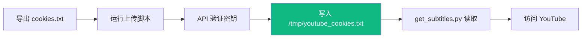

# Cookies 管理 API 使用指南

## 功能概述

Cookies 管理 API 允许你**远程更新 YouTube cookies**，无需重新部署应用。这对于 Zeabur 等无法直接上传文件的平台特别有用。

---

## API 端点

### 1. 上传/更新 Cookies

```bash
POST /api/admin/update-cookies
```

**Headers**:
```
Content-Type: application/json
X-Admin-Key: 你的管理员密钥
```

**Body**:
```json
{
  "cookies": "# Netscape HTTP Cookie File\n.youtube.com\tTRUE\t/\t..."
}
```

**成功响应** (200):
```json
{
  "success": true,
  "message": "Cookies 已更新",
  "details": {
    "cookieCount": 25,
    "fileSize": 4096,
    "timestamp": "2026-01-04T14:05:00.000Z",
    "location": "/tmp/youtube_cookies.txt"
  }
}
```

---

### 2. 检查 Cookies 状态

```bash
GET /api/admin/cookies-status
```

**Headers**:
```
X-Admin-Key: 你的管理员密钥
```

**成功响应** (200):
```json
{
  "exists": true,
  "fileSize": 4096,
  "modifiedAt": "2026-01-04T14:05:00.000Z",
  "cookieCount": 25,
  "quality": {
    "hasSecureCookies": true,
    "hasVisitorInfo": true,
    "hasLoginInfo": true,
    "score": 100
  },
  "preview": [
    ".youtube.com - LOGIN_INFO (expires)",
    ".youtube.com - VISITOR_INFO1_LIVE (expires)"
  ]
}
```

**质量分数说明**:
- `100`: 优秀（包含所有关键 cookies）
- `60-90`: 良好（缺少部分 cookies）
- `0-50`: 差（建议重新导出）

---

### 3. 删除 Cookies

```bash
DELETE /api/admin/delete-cookies
```

**Headers**:
```
X-Admin-Key: 你的管理员密钥
```

---

## 快速开始

### 步骤 1: 配置管理员密钥

```bash
# 本地环境 (.env)
ADMIN_SECRET_KEY=f3b6beb013a0d86bff6b36185198264408c9dcf9be6f24cd52b9c8c41b997ae6

# Zeabur 环境变量
同样配置到 Zeabur 控制台
```

### 步骤 2: 导出 Cookies

使用浏览器扩展 "Get cookies.txt LOCALLY" 导出 `cookies.txt`。

### 步骤 3: 上传 Cookies

**方法 A: 使用脚本（推荐）**

```bash
# 本地测试
export ADMIN_SECRET_KEY=f3b6beb013a0d86bff6b36185198264408c9dcf9be6f24cd52b9c8c41b997ae6
./tools/upload_cookies.sh

# 上传到 Zeabur
./tools/upload_cookies.sh https://你的应用.zeabur.app
```

**方法 B: 手动 curl**

```bash
COOKIES_CONTENT=$(cat cookies.txt | jq -Rs .)

curl -X POST "http://localhost:3000/api/admin/update-cookies" \
  -H "Content-Type: application/json" \
  -H "X-Admin-Key: f3b6beb013a0d86bff6b36185198264408c9dcf9be6f24cd52b9c8c41b997ae6" \
  -d "{\"cookies\": $COOKIES_CONTENT}"
```

### 步骤 4: 验证

```bash
# 使用脚本
./tools/check_cookies.sh

# 或手动
curl -X GET "http://localhost:3000/api/admin/cookies-status" \
  -H "X-Admin-Key: f3b6beb013a0d86bff6b36185198264408c9dcf9be6f24cd52b9c8c41b997ae6"
```

---

## 工作流程



---

## 常见问题

### Q: 如何更新过期的 Cookies?

```bash
# 1. 重新导出 cookies.txt
# 2. 运行上传脚本
./tools/upload_cookies.sh https://你的应用.zeabur.app

# 立即生效，无需重启
```

### Q: 如何验证 Cookies 质量?

```bash
./tools/check_cookies.sh

# 查看 score 字段
# 100 = 完美, < 50 = 需要重新导出
```

### Q: 支持定时更新吗?

可以配置 cron 任务：

```bash
# 每天凌晨 3 点更新
0 3 * * * cd /path/to/project && ./tools/upload_cookies.sh https://你的应用.zeabur.app
```

### Q: 安全性如何保证?

1. 使用 64 字符随机密钥
2. HTTPS 加密传输（生产环境）
3. 密钥不要提交到 Git

---

## 辅助脚本

### `tools/upload_cookies.sh`
上传 cookies 到服务器

### `tools/check_cookies.sh`
检查 cookies 状态和质量

---

## 下一步

1. ✅ 配置 `ADMIN_SECRET_KEY`
2. ✅ 导出高质量 cookies（勾选「保持登录」）
3. ✅ 运行 `./tools/upload_cookies.sh`
4. ✅ 测试字幕获取功能
